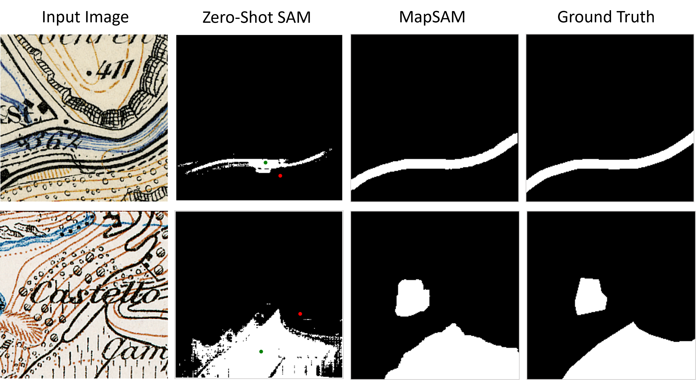

# MapSAM: Adapting Segment Anything Model for Automated Feature Detection in Historical Maps
This repository contains the implementation of the following paper:
> **MapSAM: Adapting Segment Anything Model for Automated Feature Detection in Historical Maps**<br>
> Xue Xia, Daiwei Zhang, Wenxuan Song, Wei Huang, Lorenz Hurni

## Overview
 

We propose MapSAM, a parameter-efficient fine-tuning strategy that adapts SAM into a prompt-free and versatile solution for various downstream historical map segmentation tasks. Zero-shot SAM requires manual prompts—green and red points representing poitive and negative prompts, respectively—but fails to delineate clear boundaries for the target objects effectively. In contrast, MapSAM eliminates the need for manual intervention and significantly improves segmentation accuracy.

## Installation
```
conda create -n MapSAM python=3.7
conda activate MapSAM
# install pytorch, the version is 1.9.1
pip install torch==1.9.1+cu111 torchvision==0.10.1+cu111 torchaudio==0.9.1 -f https://download.pytorch.org/whl/torch_stable.html
pip install -r requirements.txt
```

## Quick start

**Here are the instructions:**
1. Please download the pretrained [SAM model](https://drive.google.com/file/d/1_oCdoEEu3mNhRfFxeWyRerOKt8OEUvcg/view?usp=share_link) and Put it in the `./checkpoints` folder.
2. Please download the [Siegfried_Railway_Vineyard dataset](https://doi.org/10.3929/ethz-b-000691430) or use your own dataset.
3. Run te following command to test the performance of MapSAM.

**Training**
```bash
python train.py --root_path <Your dataset folder> --output <Your output path> --warmup --AdamW
```
**Testing**
```bash
python test.py --root_path <Your dataset folder> --output_dir <Your output directory> --dora_ckpt <path to dora checkpoint>
```

## Acknowledgement
The code of MapSAM is built upon [SAM](https://github.com/facebookresearch/segment-anything), [SAMed](https://github.com/hitachinsk/SAMed) and [DoRA](https://github.com/NVlabs/DoRA), and we express our gratitude to these awesome projects.
